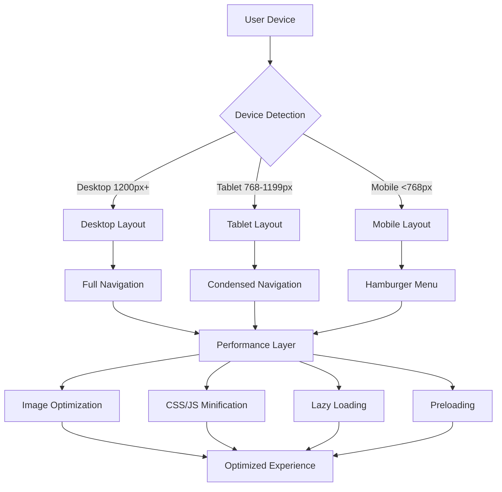
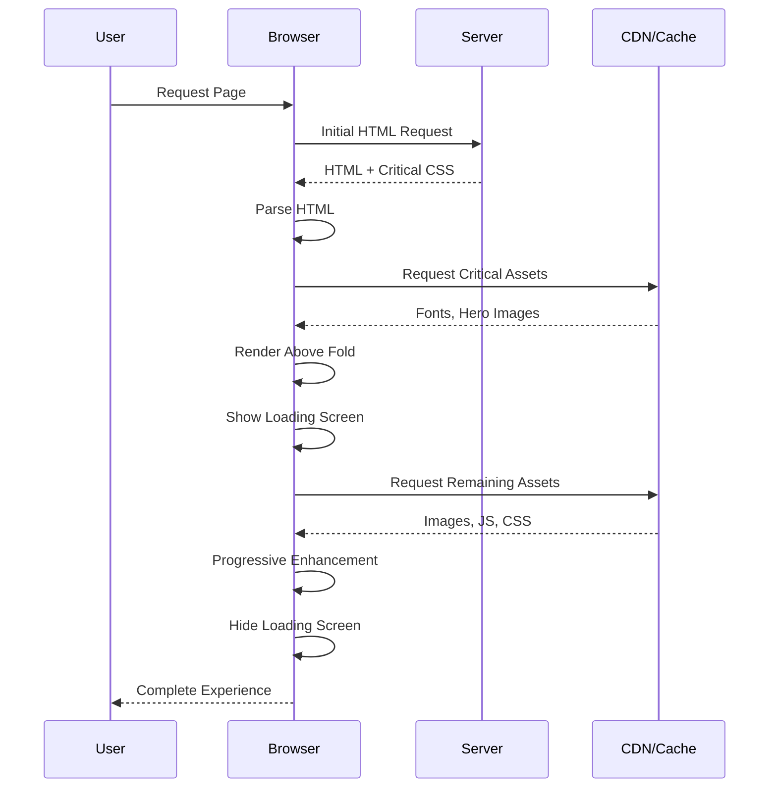
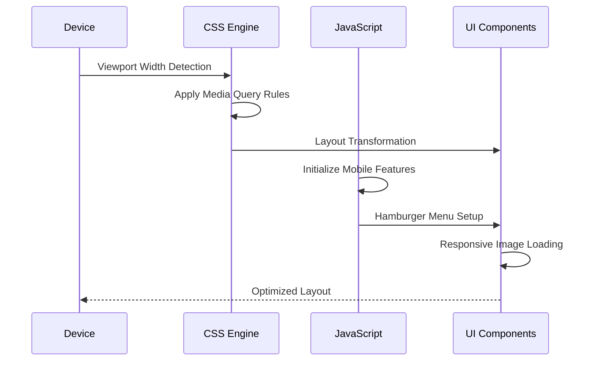

# Design Document: Website Responsive Optimization

## Overview

This design document outlines the comprehensive optimization of the BabyCue website for responsive viewing and fast loading performance. The solution maintains the existing desktop design while implementing mobile-first responsive breakpoints, performance optimizations, and enhanced user experience across all device types. The optimization focuses on three core areas: responsive design implementation, loading performance enhancement, and mobile navigation improvements.

## Architecture



## Sequence Diagrams

### Page Load Optimization Flow



### Responsive Breakpoint Detection



## Components and Interfaces

### Responsive Layout Manager

**Purpose**: Manages layout transformations across different viewport sizes

**Interface**:
```typescript
interface ResponsiveLayoutManager {
  detectViewport(): ViewportSize
  applyBreakpoint(size: ViewportSize): void
  transformNavigation(isMobile: boolean): void
  optimizeImages(viewport: ViewportSize): void
}

enum ViewportSize {
  MOBILE = 'mobile',    // <768px
  TABLET = 'tablet',    // 768px-1199px
  DESKTOP = 'desktop'   // 1200px+
}
```

**Responsibilities**:
- Detect current viewport size
- Apply appropriate CSS breakpoint rules
- Transform navigation components
- Optimize image loading strategies

### Performance Optimization Engine

**Purpose**: Handles all performance-related optimizations

**Interface**:
```typescript
interface PerformanceEngine {
  initializePreloader(): void
  lazyLoadImages(): void
  preloadCriticalAssets(): void
  minifyResources(): void
  measurePerformance(): PerformanceMetrics
}

interface PerformanceMetrics {
  loadTime: number
  firstContentfulPaint: number
  largestContentfulPaint: number
  cumulativeLayoutShift: number
}
```

**Responsibilities**:
- Display loading screen during initial load
- Implement lazy loading for below-fold images
- Preload critical fonts and hero images
- Monitor and report performance metrics

### Mobile Navigation Controller

**Purpose**: Manages mobile-specific navigation behavior

**Interface**:
```typescript
interface MobileNavigationController {
  toggleHamburgerMenu(): void
  handleDropdownInteraction(dropdown: Element): void
  closeMenuOnLinkClick(): void
  setupTouchGestures(): void
}
```

**Responsibilities**:
- Control hamburger menu open/close states
- Handle dropdown menu interactions on mobile
- Manage touch-friendly navigation
- Ensure accessibility compliance

## Data Models

### Responsive Configuration

```typescript
interface ResponsiveConfig {
  breakpoints: {
    mobile: number      // 768
    tablet: number      // 1200
  }
  navigation: {
    mobileThreshold: number
    hamburgerEnabled: boolean
    dropdownBehavior: 'hover' | 'click'
  }
  performance: {
    lazyLoadOffset: number
    preloadAssets: string[]
    targetLoadTime: number
  }
}
```

**Validation Rules**:
- Breakpoints must be positive integers
- Mobile threshold must be less than tablet threshold
- Target load time must be under 5 seconds
- Preload assets must be valid file paths

### Image Optimization Settings

```typescript
interface ImageOptimization {
  formats: ('webp' | 'avif' | 'jpg' | 'png')[]
  sizes: {
    mobile: string
    tablet: string
    desktop: string
  }
  lazyLoading: {
    enabled: boolean
    rootMargin: string
    threshold: number
  }
  compression: {
    quality: number
    progressive: boolean
  }
}
```

**Validation Rules**:
- Quality must be between 1-100
- Sizes must be valid CSS values
- Threshold must be between 0-1
- Root margin must be valid CSS margin value

## Algorithmic Pseudocode

### Main Responsive Initialization Algorithm

```pascal
ALGORITHM initializeResponsiveOptimization()
INPUT: none
OUTPUT: optimized responsive website

BEGIN
  // Step 1: Initialize performance monitoring
  performanceStart ← getCurrentTime()
  
  // Step 2: Show loading screen
  showPreloader()
  
  // Step 3: Detect viewport and apply initial layout
  viewport ← detectViewportSize()
  applyResponsiveLayout(viewport)
  
  // Step 4: Initialize navigation based on viewport
  IF viewport = MOBILE THEN
    initializeMobileNavigation()
  ELSE
    initializeDesktopNavigation()
  END IF
  
  // Step 5: Setup performance optimizations
  preloadCriticalAssets()
  initializeLazyLoading()
  
  // Step 6: Setup responsive listeners
  setupViewportChangeListeners()
  setupImageOptimization()
  
  // Step 7: Complete initialization
  hidePreloader()
  measureAndReportPerformance(performanceStart)
  
  RETURN success
END
```

**Preconditions**:
- DOM is fully loaded
- CSS and JavaScript resources are available
- Browser supports modern responsive features

**Postconditions**:
- Responsive layout is active and functional
- Performance optimizations are running
- Navigation works correctly on all devices
- Loading time is under 5 seconds

**Loop Invariants**: N/A (no loops in main algorithm)

### Viewport Detection and Layout Algorithm

```pascal
ALGORITHM detectAndApplyResponsiveLayout()
INPUT: none
OUTPUT: applied responsive layout

BEGIN
  // Get current viewport dimensions
  viewportWidth ← window.innerWidth
  viewportHeight ← window.innerHeight
  
  // Determine breakpoint category
  IF viewportWidth < 768 THEN
    currentBreakpoint ← MOBILE
  ELSE IF viewportWidth < 1200 THEN
    currentBreakpoint ← TABLET
  ELSE
    currentBreakpoint ← DESKTOP
  END IF
  
  // Apply layout transformations
  MATCH currentBreakpoint WITH
    CASE MOBILE:
      applyMobileLayout()
      enableHamburgerMenu()
      stackSectionsVertically()
      optimizeImagesForMobile()
    
    CASE TABLET:
      applyTabletLayout()
      condenseNavigation()
      adjustGridLayouts()
      optimizeImagesForTablet()
    
    CASE DESKTOP:
      applyDesktopLayout()
      showFullNavigation()
      maintainOriginalLayout()
      optimizeImagesForDesktop()
  END MATCH
  
  // Update global state
  updateCurrentBreakpoint(currentBreakpoint)
  
  RETURN currentBreakpoint
END
```

**Preconditions**:
- Window object is available
- CSS breakpoint rules are defined
- Layout transformation functions exist

**Postconditions**:
- Correct layout is applied for current viewport
- Navigation is appropriate for device type
- Images are optimized for current screen size
- Global breakpoint state is updated

**Loop Invariants**: N/A (no loops in this algorithm)

### Performance Optimization Algorithm

```pascal
ALGORITHM optimizeWebsitePerformance()
INPUT: none
OUTPUT: performance optimizations applied

BEGIN
  // Step 1: Preload critical resources
  criticalAssets ← ["fonts/sora-600.woff2", "fonts/dm-serif-display-regular.woff2", 
                    "images/Logo_BabyCue.png", "css/styles.css"]
  
  FOR each asset IN criticalAssets DO
    preloadAsset(asset)
  END FOR
  
  // Step 2: Initialize lazy loading for images
  images ← document.querySelectorAll('img[data-src]')
  
  FOR each image IN images DO
    IF isInViewport(image, "50px") THEN
      loadImage(image)
    ELSE
      observeForLazyLoad(image)
    END IF
  END FOR
  
  // Step 3: Minify and compress resources
  minifyCSS()
  minifyJavaScript()
  enableGzipCompression()
  
  // Step 4: Setup performance monitoring
  measureFirstContentfulPaint()
  measureLargestContentfulPaint()
  measureCumulativeLayoutShift()
  
  // Step 5: Optimize animations for performance
  enableGPUAcceleration()
  optimizeScrollHandlers()
  
  RETURN performanceMetrics
END
```

**Preconditions**:
- Critical assets exist and are accessible
- Browser supports Intersection Observer API
- Performance measurement APIs are available

**Postconditions**:
- Critical assets are preloaded
- Lazy loading is acti
ve for non-critical images
- Resources are minified and compressed
- Performance metrics are being tracked
- Animations are GPU-accelerated

**Loop Invariants**:
- All processed assets maintain their functionality
- Performance optimizations don't break existing features
- Each optimization step improves overall performance

### Mobile Navigation Algorithm

```pascal
ALGORITHM handleMobileNavigation()
INPUT: navigationEvent (hamburger click, dropdown interaction, link click)
OUTPUT: updated navigation state

BEGIN
  MATCH navigationEvent.type WITH
    CASE "hamburger_click":
      currentState ← getHamburgerMenuState()
      
      IF currentState = "closed" THEN
        showMobileMenu()
        setHamburgerState("open")
        enableBodyScrollLock()
      ELSE
        hideMobileMenu()
        setHamburgerState("closed")
        disableBodyScrollLock()
      END IF
    
    CASE "dropdown_interaction":
      dropdown ← navigationEvent.target
      
      IF isMobileViewport() THEN
        toggleDropdownMobile(dropdown)
      ELSE
        handleDropdownHover(dropdown)
      END IF
    
    CASE "link_click":
      IF isMobileMenuOpen() THEN
        hideMobileMenu()
        setHamburgerState("closed")
        disableBodyScrollLock()
      END IF
      
      navigateToSection(navigationEvent.target.href)
  END MATCH
  
  // Update accessibility attributes
  updateAriaAttributes()
  
  RETURN navigationState
END
```

**Preconditions**:
- Navigation elements exist in DOM
- Event listeners are properly attached
- Mobile detection functions are available

**Postconditions**:
- Navigation state is correctly updated
- Mobile menu visibility matches user interaction
- Accessibility attributes are current
- Body scroll is managed appropriately

**Loop Invariants**: N/A (no loops in this algorithm)

## Key Functions with Formal Specifications

### Function 1: applyResponsiveBreakpoint()

```typescript
function applyResponsiveBreakpoint(viewport: ViewportSize): void
```

**Preconditions:**
- `viewport` is a valid ViewportSize enum value
- CSS breakpoint rules are defined and loaded
- DOM elements for layout transformation exist

**Postconditions:**
- Correct CSS classes are applied to body element
- Navigation component matches viewport requirements
- Grid layouts are transformed appropriately
- Image sizes are optimized for current viewport

**Loop Invariants:** N/A (function uses conditional logic, not loops)

### Function 2: initializeLazyLoading()

```typescript
function initializeLazyLoading(options: LazyLoadOptions): IntersectionObserver
```

**Preconditions:**
- `options.rootMargin` is a valid CSS margin value
- `options.threshold` is between 0 and 1
- Browser supports IntersectionObserver API
- Images with `data-src` attributes exist in DOM

**Postconditions:**
- IntersectionObserver is created and active
- All lazy-loadable images are being observed
- Images load when entering viewport with specified margin
- Loading performance is improved for below-fold content

**Loop Invariants:**
- For image observation loop: All previously processed images remain observed
- Observer callback maintains consistent loading behavior

### Function 3: optimizeImageLoading()

```typescript
function optimizeImageLoading(image: HTMLImageElement, viewport: ViewportSize): void
```

**Preconditions:**
- `image` is a valid HTMLImageElement
- `viewport` is a valid ViewportSize enum value
- Image source URLs are accessible
- Modern image formats (WebP, AVIF) are supported or have fallbacks

**Postconditions:**
- Appropriate image size is loaded for current viewport
- Modern image formats are used when supported
- Image loading doesn't block critical rendering path
- Proper alt text and accessibility attributes are maintained

**Loop Invariants:** N/A (function processes single image)

## Example Usage

```typescript
// Example 1: Initialize responsive optimization system
const responsiveManager = new ResponsiveLayoutManager({
  breakpoints: { mobile: 768, tablet: 1200 },
  performance: { targetLoadTime: 5000, lazyLoadOffset: '50px' }
});

// Initialize the system
responsiveManager.initialize();

// Example 2: Handle viewport changes
window.addEventListener('resize', debounce(() => {
  const currentViewport = responsiveManager.detectViewport();
  responsiveManager.applyBreakpoint(currentViewport);
}, 250));

// Example 3: Setup mobile navigation
const mobileNav = new MobileNavigationController();
document.getElementById('navHamburger')?.addEventListener('click', () => {
  mobileNav.toggleHamburgerMenu();
});

// Example 4: Initialize performance optimizations
const performanceEngine = new PerformanceEngine({
  preloadAssets: [
    'assets/fonts/sora-600.woff2',
    'assets/images/Logo_BabyCue.png'
  ],
  lazyLoadImages: true,
  targetMetrics: {
    firstContentfulPaint: 1500,
    largestContentfulPaint: 2500
  }
});

performanceEngine.initialize();
```

## Correctness Properties

*A property is a characteristic or behavior that should hold true across all valid executions of a system-essentially, a formal statement about what the system should do. Properties serve as the bridge between human-readable specifications and machine-verifiable correctness guarantees.*

### Property 1: Responsive Breakpoint Accuracy

*For any* viewport width, the system should apply the correct breakpoint classification: mobile for widths below 768px, tablet for widths between 768px and 1199px, and desktop for widths 1200px and above.

**Validates: Requirements 1.1, 1.2, 1.3**

### Property 2: Performance Load Time Guarantee

*For any* website page, when performance optimizations are applied, the page should complete initial load within 5 seconds and achieve First Contentful Paint within 1.5 seconds.

**Validates: Requirements 2.1, 2.5**

### Property 3: Mobile Navigation Consistency

*For any* mobile device interaction with the navigation system, the hamburger menu should display correctly below 968px viewport width, show overlay when activated, and close automatically when navigation links are clicked.

**Validates: Requirements 3.1, 3.2, 3.3**

### Property 4: Image Loading Optimization

*For any* image on the website, the system should load appropriate sizes for the current viewport, implement lazy loading for below-fold images, and serve modern formats with fallbacks when supported.

**Validates: Requirements 4.1, 4.2, 4.3**

### Property 5: Layout Preservation Across Breakpoints

*For any* responsive layout transformation, all content should remain readable and accessible, all functionality should be preserved, and no content should be lost or truncated.

**Validates: Requirements 1.4, 1.5, 9.1, 9.4**

### Property 6: Error Recovery and Blank Page Prevention

*For any* system failure scenario (JavaScript errors, CSS loading failures, network issues), the website should maintain basic functionality and never display completely blank pages.

**Validates: Requirements 5.1, 5.2, 5.3, 5.4, 5.5**

### Property 7: Cross-Browser Compatibility

*For any* modern browser (Chrome, Firefox, Safari, Edge), the responsive system should provide identical functionality with appropriate fallbacks for unsupported features.

**Validates: Requirements 6.1, 6.2, 6.3, 6.5**

### Property 8: Loading State Feedback

*For any* loading operation, the system should provide visual feedback within 100ms, show progress indicators during resource loading, and hide loading screens smoothly when ready.

**Validates: Requirements 7.1, 7.2, 7.3, 7.4**

### Property 9: Accessibility Compliance

*For any* user interaction method (keyboard, screen reader, touch), the responsive system should maintain proper accessibility features including focus management, semantic structure, and adequate touch target sizes.

**Validates: Requirements 8.1, 8.2, 8.3, 8.5**

### Property 10: Content and Functionality Preservation

*For any* responsive transformation, all navigation items should remain accessible, interactive elements should maintain functionality, and images should preserve aspect ratios and quality.

**Validates: Requirements 9.2, 9.3, 9.5**

### Property 11: Performance Monitoring and Adaptation

*For any* page load, the system should measure Core Web Vitals metrics, identify performance bottlenecks when targets are missed, and adapt optimization strategies based on performance data.

**Validates: Requirements 11.1, 11.2, 11.3**

### Property 12: Mobile-First Progressive Enhancement

*For any* screen size detection, the system should apply mobile styles as the base design and progressively enhance for larger screens while optimizing for touch interactions and limited bandwidth.

**Validates: Requirements 12.1, 12.2, 12.3, 12.4**

## Error Handling

### Error Scenario 1: Viewport Detection Failure

**Condition**: Browser doesn't support modern viewport detection APIs
**Response**: Fallback to user agent detection and default breakpoints
**Recovery**: Apply conservative mobile-first layout and progressive enhancement

### Error Scenario 2: Image Loading Failure

**Condition**: Network issues prevent image loading or modern formats aren't supported
**Response**: Display fallback images and retry mechanism for failed loads
**Recovery**: Graceful degradation to standard image formats with appropriate alt text

### Error Scenario 3: Performance Target Miss

**Condition**: Website fails to meet 5-second load time target
**Response**: Log performance metrics and identify bottlenecks
**Recovery**: Apply additional optimizations like resource prioritization and code splitting

### Error Scenario 4: Mobile Navigation Malfunction

**Condition**: Touch events or mobile menu interactions fail
**Response**: Fallback to always-visible navigation links
**Recovery**: Ensure all navigation remains accessible through alternative methods

## Testing Strategy

### Unit Testing Approach

**Responsive Layout Functions**:
- Test viewport detection accuracy across different screen sizes
- Verify CSS class application for each breakpoint
- Validate layout transformations maintain design integrity
- Test navigation component behavior on different devices

**Performance Optimization Functions**:
- Mock network conditions to test lazy loading behavior
- Verify preloading of critical assets
- Test image optimization for different viewport sizes
- Validate performance metric collection accuracy

**Coverage Goals**: 90% code coverage for all responsive and performance functions

### Property-Based Testing Approach

**Property Test Library**: fast-check (JavaScript/TypeScript)

**Test Properties**:
1. **Viewport Consistency**: For any valid viewport width, the applied breakpoint should be deterministic and correct
2. **Performance Bounds**: All optimized pages should load within specified time limits
3. **Navigation Accessibility**: All navigation interactions should remain accessible across device types
4. **Image Optimization**: All images should be appropriately sized and formatted for their viewport

**Test Generation Strategy**:
- Generate random viewport widths and verify correct breakpoint application
- Create various network conditions and ensure performance targets are met
- Test navigation with different interaction patterns and device capabilities

### Integration Testing Approach

**Cross-Browser Testing**:
- Test responsive behavior on Chrome, Firefox, Safari, and Edge
- Verify mobile navigation on actual mobile devices
- Test performance optimizations across different network speeds

**Device Testing**:
- Physical testing on iPhone, Android, iPad, and desktop browsers
- Verify touch interactions and gesture support
- Test accessibility with screen readers and keyboard navigation

**Performance Testing**:
- Load testing with various network conditions (3G, 4G, WiFi)
- Stress testing with multiple concurrent users
- Performance regression testing after code changes

## Performance Considerations

**Target Metrics**:
- Page load time: < 5 seconds
- First Contentful Paint: < 1.5 seconds
- Largest Contentful Paint: < 2.5 seconds
- Cumulative Layout Shift: < 0.1

**Optimization Strategies**:
- Critical CSS inlining for above-fold content
- Progressive image loading with modern formats (WebP, AVIF)
- JavaScript code splitting and lazy loading
- CDN utilization for static assets
- Gzip compression for all text-based resources

**Monitoring and Alerting**:
- Real User Monitoring (RUM) for performance tracking
- Automated performance budgets in CI/CD pipeline
- Core Web Vitals monitoring and reporting
- Performance regression alerts

## Security Considerations

**Content Security Policy (CSP)**:
- Restrict image sources to trusted domains
- Prevent inline script execution for performance optimizations
- Ensure lazy loading doesn't introduce XSS vulnerabilities

**Resource Loading Security**:
- Validate all preloaded assets are from trusted sources
- Implement Subresource Integrity (SRI) for critical assets
- Secure image optimization endpoints against abuse

**Mobile Security**:
- Ensure touch event handlers don't leak sensitive information
- Validate mobile navigation doesn't expose unintended functionality
- Implement proper HTTPS enforcement for all responsive assets

## Dependencies

**Core Dependencies**:
- Modern browser support (ES2018+, IntersectionObserver API)
- CSS Grid and Flexbox support
- Touch event API for mobile interactions
- Performance Observer API for metrics collection

**External Libraries**:
- Intersection Observer polyfill for older browsers
- Web font loading optimization library
- Image lazy loading library (if not using native implementation)
- Performance monitoring SDK

**Build Tools**:
- CSS minification and autoprefixing tools
- JavaScript bundling and minification
- Image optimization and format conversion tools
- Performance budget enforcement tools

**Infrastructure Requirements**:
- CDN for static asset delivery
- Image optimization service or build pipeline
- Performance monitoring service
- Error tracking and logging system